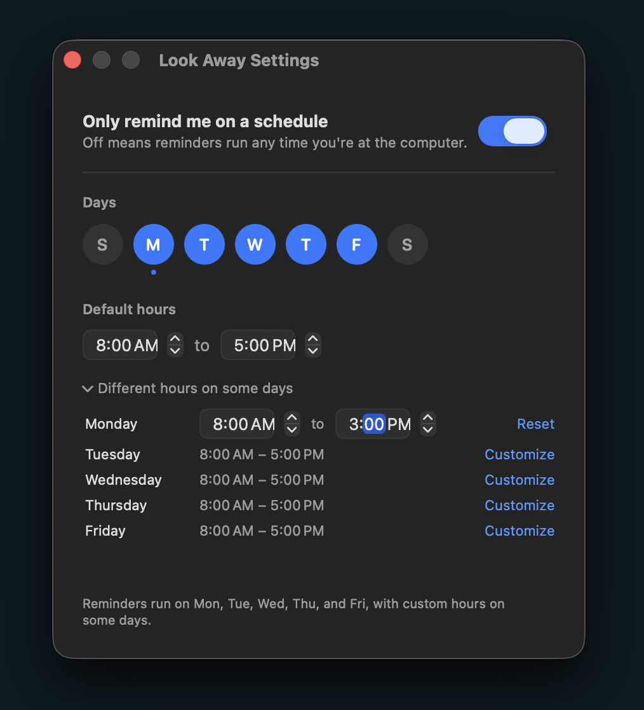

# Look Away

A tiny macOS menu bar app for the 20/20/20 rule: every 20 minutes of screen
time, look at something 20 feet away for 20 seconds.

<p align="center">
  <picture>
    <source media="(prefers-color-scheme: dark)" srcset="docs/popup-dark.png">
    
  </picture>
</p>

## Behavior

- Lives in the menu bar (eye icon). No Dock icon, no main window.
- Every 20 minutes a floating panel appears on the display your cursor is on,
  above every other window, without taking keyboard focus from your current app.
- The panel starts a 20-second countdown the moment it appears. At zero it
  shows "Done", plays a soft chime, and closes itself.
- **Delay 5 min** hides the panel and brings it back later with a fresh
  20-second countdown. Delays can be chained.
- **Decline** closes the panel immediately.
- The next 20-minute interval starts when the panel closes (finished or
  declined), never from a snooze.
- Sleep or screen lock pauses everything; wake or unlock starts a fresh
  20 minutes.
- Menu: live "Next break in m:ss", Pause / Resume Reminders, Take a Break Now,
  Launch at Login, Settings, Quit.

Durations live in `Sources/LookAwayCore/Config.swift`.

## Schedule

**Settings…** in the menu opens a schedule panel. It is opt-in: leave it off and
reminders run around the clock, exactly as before.

<p align="center">
  
</p>

- Click the S M T W T F S circles to pick the days reminders should run on.
- One start and end time covers every selected day — set 9:00 AM to 5:00 PM once
  and the whole week follows it.
- Need an exception? **Different hours on some days** reveals a row per selected
  day where any one of them can be given its own start and end. Days with their
  own hours get a dot under their circle; **Reset** puts them back on the shared
  hours. (Right-clicking a day circle offers the same thing.)
- An end time earlier than the start reads as overnight, so 10:00 PM to 2:00 AM
  works for a night shift; the panel marks it "(next day)". The same start and
  end time runs all day.
- Outside the schedule the menu bar shows a moon and the menu reads
  "Outside schedule — back Mon at 9:00 AM". The hold begins the moment the
  window closes. **Take a Break Now** still works.

The schedule is saved to preferences and applied the moment it is edited, without
restarting the current 20 minutes. The settings window closes with ⌘W or Esc and
reopens where you left it.

## Install

There is no prebuilt download. You build the app yourself, which takes about a
minute and needs two things:

- macOS 14 Sonoma or newer.
- Xcode 16 or newer, installed from the Mac App Store and opened once so it
  can finish setting up its command line tools.

Then, in Terminal:

```bash
git clone https://github.com/connortorrell/look-away.git
cd look-away
make install
```

`make install` does everything: it compiles the app, wraps it into
`Look Away.app`, signs it for local use, copies it to your `Applications`
folder, and launches it. Because it's built on your own Mac, there is no
Gatekeeper warning.

When it's running you'll see an eye icon in the menu bar. Click it to see the
time until the next break, pause reminders, or take a break right away. The
first popup arrives 20 minutes after launch.

The app adds itself to your login items the first time it runs from
`Applications`, so it starts automatically after a restart. Turn that off from
the menu with **Launch at Login** if you'd rather start it by hand.

### Updating

```bash
cd look-away
git pull
make install
```

### Uninstalling

Quit Look Away from its menu, then drag `Look Away.app` out of `Applications`
to the Trash. If Launch at Login was on, macOS removes the login item with it.

### Other make targets

| Command        | What it does                                   |
|----------------|------------------------------------------------|
| `make test`    | Runs the scheduler unit tests                  |
| `make run`     | Builds and launches from `./build` (dev loop)  |
| `make bundle`  | Builds the `.app` without launching            |
| `make clean`   | Removes build output                           |

## Layout

- `Sources/LookAwayCore` — pure Foundation: `Config`, the `Timekeeper` clock
  abstraction, the `Schedule` model and its storage, and the `BreakScheduler`
  state machine.
- `Sources/LookAway` — AppKit/SwiftUI shell: menu bar item, floating panel,
  break view, settings panel, sleep/lock observers, launch-at-login.
- `Tests/LookAwayCoreTests` — scheduler tests driven by a fake clock.
